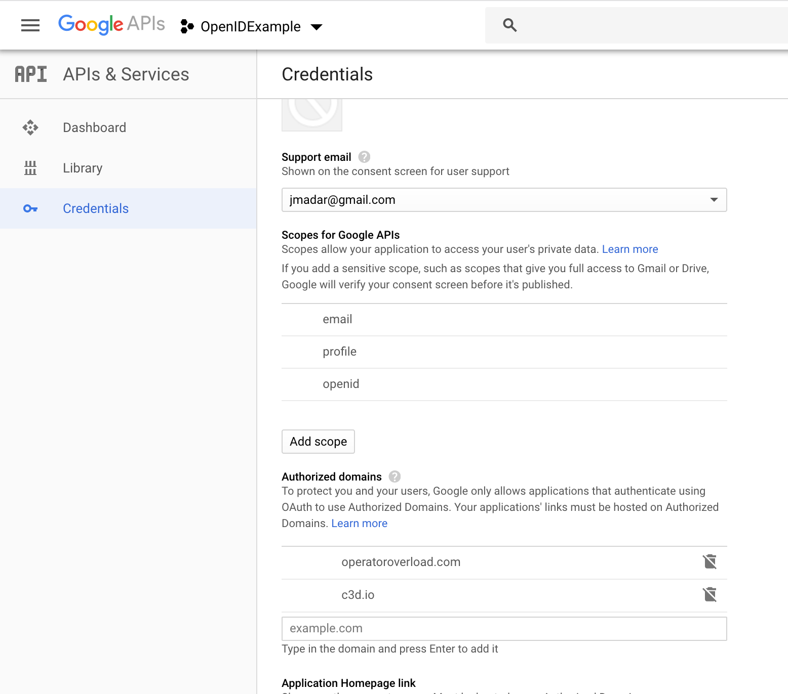
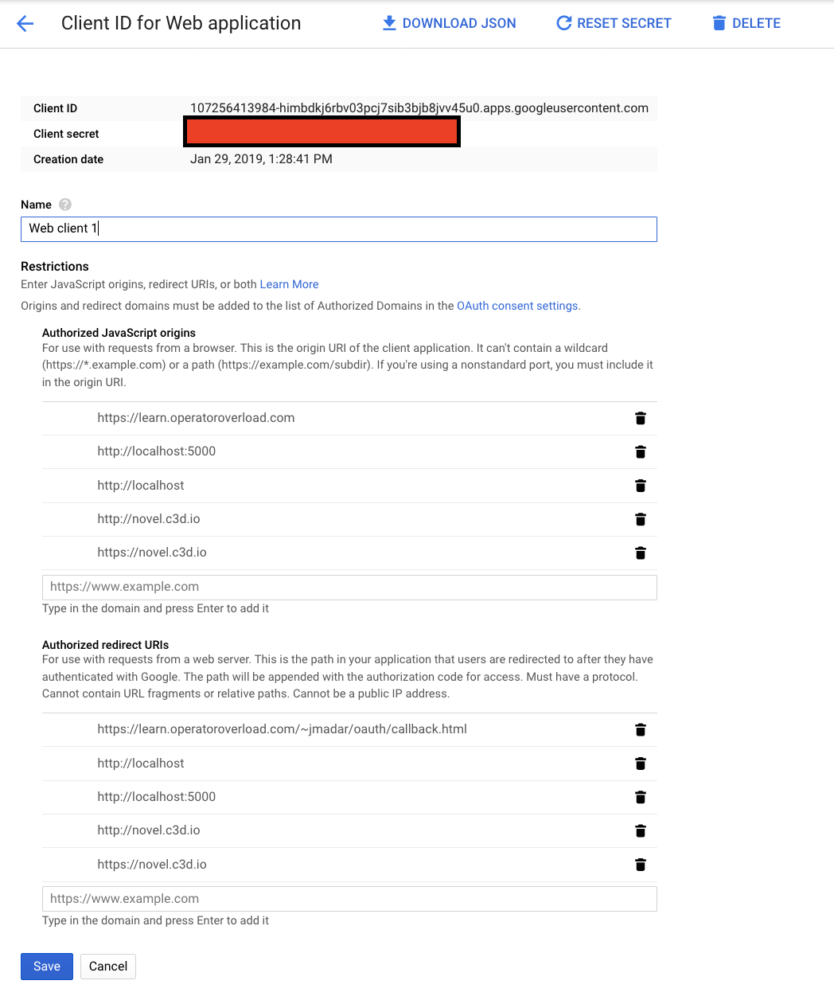
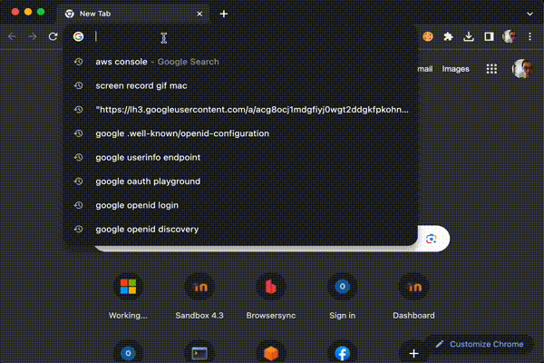

# Introduction

Goal: Create your own “Login via Google” button

First, study the example at https://github.com/env3d/oauth-basic-tutorial.
The index.html file is a very basic (but functional) example of how you can
login to Facebook using the OAuth 2.0 protocol.

It turns out many major cloud providers (such as Google, Apple, etc.)
also act as identity providers.  This assignment will have you modify the
Facebook example so it'll work with Google instead.

To see how the Google login works, use the Google OAuth 2.0 playground
https://developers.google.com/oauthplayground/ app.  It contains the same
3 steps that's illustrated in my example above.

NOTE: In this assignment, we are implementing the OAuth 2.0 flow manually,
which is NOT RECOMMENDED for production systems as the protocol is very
complex.  In a production environment, use SDKs provided by various vendors
such as Firebase, passport.js, etc.

# Steps

  1. Go to https://console.developers.google.com and register a new project
  
  1. For now, do not enable any additional API and services, as we will simply
     be using google for authentication (OpenID Connect)

  1. Under the "Credentials" menu, select the "OAuth Consent Screen" tab and make
     sure you fill in the scope and “Authorized Domains” section so google can
     redirect back to your site.

     

  1. Go back to the "credentials" tab and select
     "Create credentials" -> "OAuth Client ID" to create a
     "Client ID/Client Secret" pair.

  1. Be sure to fill out the "Authorized Javascript Origin" and
     "Authorized Redirect URL"!  The Authorized Redirect URL will
     be the URL of your index.html file.

     

  1. Now that your google oauth2 client is set up, you are ready to code.
     In your web server, put a copy of the index.html file from
     https://github.com/env3d/oauth-basic-tutorial/blob/main/index.html
     to the `/var/www/html/oauth-basic-tutorial` directory, this way
     you can access this file using the url
     https://xxx.wmdd4950.com/oauth-basic-tutorial/
     where xxx is your custom domain name.

  1. Below are the few things you need to change in the facebook example
     so it'll work with Google:

        - Change the client ID to your app's client id
	- In step 1
	    - The google login url is https://accounts.google.com/o/oauth2/v2/auth
	    - In the scope field, Instead of the `public_profile`, Google's scope is simply `profile`
	- In step 2
	    - The token exchange url is https://oauth2.googleapis.com/token
	    - The token exhcange uses POST, not GET
	    - The `content-type` of the token exchange request must be
	      `application/x-www-form-urlencoded`
	- In step 4
	    - The json returned has a slightly different structure

  1. The end result should look something like this:

     


# Hand-in

Clone the assignment repo into your `${HOME}` directory, then execute pytest
in the `${HOME}/${ASSIGNMENT_REPO}/` to check if you got everything correct,
as follows:

```
cd ~
git clone ${ASSIGNMENT_REPO}
cd ${ASSIGNMENT_REPO}
pytest
```

When you are satisified, run the following commands to submit:

  - git add -A
  - git commit -a -m 'submit'
  - git push

